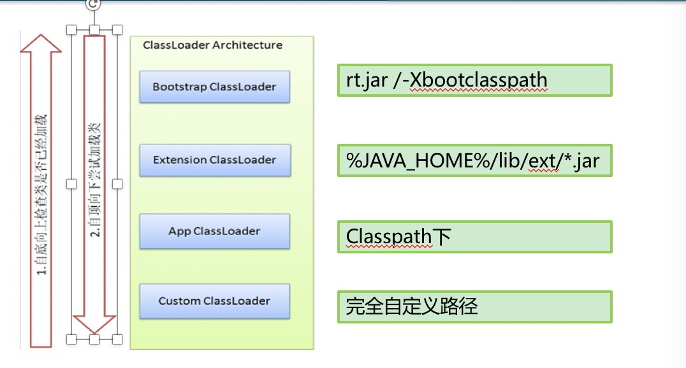

## 类装载的机制
加载 -> 链接 -> 初始化

## 类加载器的种类
ClassLoader是一个抽象类
ClassLoader的实例负责吧字节码文件读取到JVM中
ClassLoader可以定制，满足不同的字节码流获取方式
ClassLoader负责类装载的`加载阶段`

* BootClassLoader
``` text
根加载器
Java 核心Class文件  rt.jar 就是由BootLoader加载的
```
* ExtLoader
``` text
扩展加载器

```
* AppLoader
```text
应用加载器
自己写的类一般由这个类加载器启动
```
* ConsumerLoader


``` text
public Class<?> loadClass(String name) throws ClassNotFoundException
载入并返回一个Class

protected final Class<?> defineClass(byte[] b, int off, int len)
定义一个类，不公开调用

protected Class<?> findClass(String name) throws ClassNotFoundException
loadClass回调该方法，自定义ClassLoader的推荐做法

protected final Class<?> findLoadedClass(String name) 
寻找已经加载的类
```
### 类加载器的工作模式
* 自下而上的寻找Class
* 自上而下的加载Class


### 类默认加载器的双亲委托模式
双亲委托模式的是通过组合上层ClassLoader来感知上层加载的类的,
内部包含一个parentClassLoader 当需要向上查找类的时候,
调用parent的方法即可.

* 双亲委托模式的问题
 默认类加载机制上层ClassLoader无法感知下载ClassLoader加载的的类
所以当使用上层类加载器加载类的时候可会会出现类ClassNotDef的异常
* 如何解决
 通过Thread.setContentClassLoader设置最下层的类加载器

## JVM如何获取加载的类
